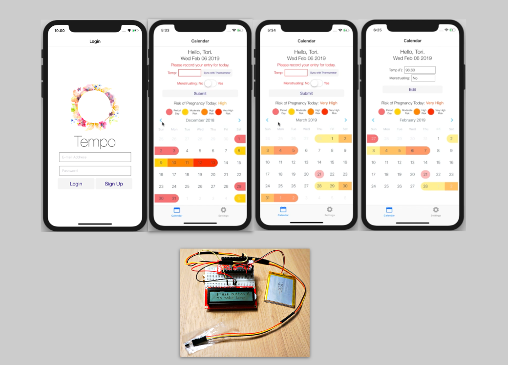

# Tempo Mobile

Tempo helps women gain ovulation intelligence and predict future cycles. Tempo is now a mobile app, complete with a compatible, proof-of-concept, wifi thermometer to automatically send your basal body temp to your phone.

## Demo 02/06/2019

[Go to YouTube](https://www.youtube.com/watch?v=eW5qm1l2TSk)

## Technologies

* Javascript, HTML, CSS
* React Native
* Express: [code found here](https://github.com/torizoemitchell/tempoMobile-server)
* PostgreSQL
* Heroku
* C++ and Arduino IDE: [code found here](https://github.com/torizoemitchell/arduinosketches)
* ESP32 Thing
